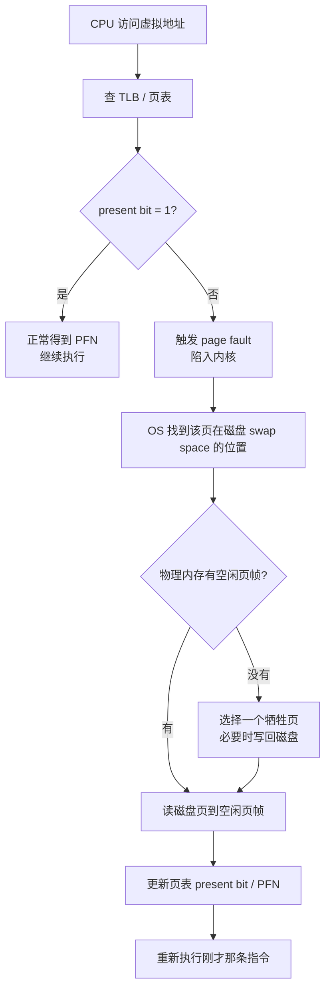

# 第21章 超越物理内存：机制

> [!INFO] 核心问题
> [[分页机制 (Paging)]]让地址空间很灵活，但如果所有进程真正用到的页加起来超过物理内存，怎么办？

---

## 为什么需要

前面的分页、多级页表、TLB，默认有一个前提：

```text
进程要用的页，最后都能放进物理内存
```

但现实不是这样。

一个进程可能有很大的地址空间，多个进程加起来也可能远远超过物理内存。
如果要求所有页都必须在内存里，程序就很容易跑不起来。

所以 OS 引入了一个更大胆的想法：

> 不是所有虚拟页都必须待在物理内存里。
> 暂时不用的页，可以先放到磁盘上。

这就是**交换（swapping）**。

---

## 核心思想

物理内存只放当前比较需要的页。
不常用的页可以被换到磁盘上的 **swap space（交换区）**。

```text
虚拟地址空间很大
    ↓
物理内存只缓存一部分页
    ↓
其他页暂时放在磁盘 swap space
```

这就像桌面放不下所有书，就把暂时不用的书放回书架。
桌面是物理内存，书架是磁盘。

---

## 图示：内存和交换区


---

## Present Bit

页表项里会有一个 **present bit（存在位）**：

- present = 1：这个页在物理内存里，可以直接访问。
- present = 0：这个页不在物理内存里，可能在磁盘上。

所以页表项不只是记录 `VPN -> PFN`，还要记录这个页现在到底在不在内存。

---

## Page Fault

如果程序访问一个页，但这个页的 present bit = 0，就会触发 **page fault（页错误）**。

注意：
page fault 不一定是程序写错了。
它可能只是说明：这个页现在不在内存，需要 OS 从磁盘把它拿回来。

---

## Page Fault 处理流程



---

## 如果内存满了怎么办

如果发生 page fault，但物理内存已经满了，OS 就要找一个页踢出去。
被踢出去的页叫 **victim page（牺牲页）**。

这一步就引出第22章：

> 到底应该踢谁？

这就是 [[超越物理内存：策略|页面置换策略]]。

---

## Dirty Bit

如果一个页在内存里被修改过，它就是**脏页（dirty page）**。
脏页被换出时，必须先写回磁盘，否则修改会丢。

如果一个页没有被修改过，直接丢掉就行。
反正磁盘上原本就有一份。

| 页状态 | 换出时怎么办 |
| --- | --- |
| clean page | 直接丢掉 |
| dirty page | 先写回磁盘，再换出 |

---

## 缺陷

- 磁盘比内存慢很多，page fault 代价很高。
- 如果缺页太频繁，程序会大部分时间都在等磁盘。
- 物理内存满了之后，必须依赖好的置换策略。

---

## 我自己的理解

虚拟内存像是在骗程序：
“你放心用，内存看起来很大。”

但 OS 心里很清楚，真正的物理内存没那么大。
所以它把物理内存当缓存，把磁盘当后备仓库。
程序要用的页不在内存，就触发 page fault，再从仓库里搬回来。

第21章讲的是**怎么搬**，第22章讲的是**该把谁搬出去**。
