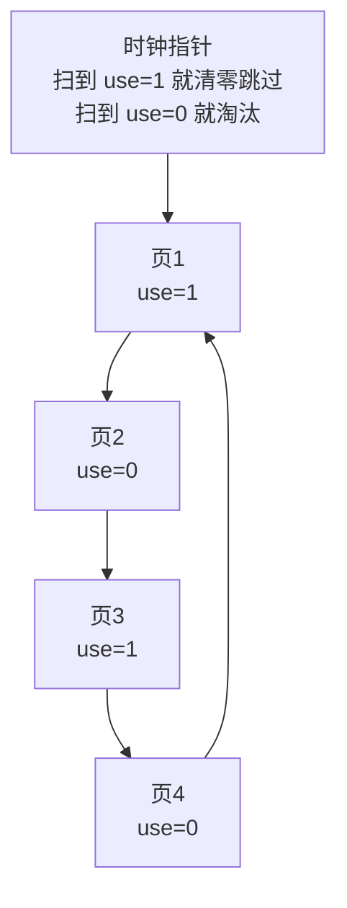

# 第22章 超越物理内存：策略

> [!INFO] 核心问题
> 物理内存满了，又来了一个要用的页，OS 应该把哪个页换出去？

---

## 为什么需要策略

第21章 [[超越物理内存：机制]]解决的是：

```text
页不在内存怎么办？ -> 触发 page fault，从磁盘换回来
```

但如果内存已经满了，就必须先踢走一个页。

问题来了：

```text
踢哪个页，未来 page fault 最少？
```

这就是**页面置换策略（page replacement policy）**。

---

## 评价指标

最直接的指标是 **cache hit rate（命中率）**：

- 命中：要访问的页已经在内存里。
- 未命中：页不在内存，触发 page fault。

也可以看 **page fault 次数**：
缺页越少，策略越好。

---

## 把物理内存看成缓存

这章的核心视角是：

> 物理内存是虚拟地址空间的缓存。


既然是缓存，就有一个经典问题：
缓存满了，新东西进来，旧东西该赶谁走？

---

## 最优策略 OPT

**OPT（Optimal Replacement）**的想法：

> 淘汰未来最晚才会被访问的页。

比如未来访问序列是：

```text
A B C A B D
```

如果现在必须从 A、B、C 里踢一个，C 最晚再被访问，甚至可能不再访问，那就踢 C。

**优点：**

- 理论上最优，page fault 最少。

**缺点：**

- 现实中做不到，因为 OS 不知道未来。

所以 OPT 更像标准答案，用来对比其他策略有多差。

---

## FIFO

**FIFO（先进先出）**的想法：

> 谁最早进入内存，就先淘汰谁。

它像排队买奶茶：先来的先走。

**优点：**

- 实现简单。
- 只要维护一个队列。

**缺点：**

- 早进来的页不一定没用。
- 可能把一个经常被访问的老页换出去。

---

## Random

**Random（随机置换）**的想法：

> 随便选一个页淘汰。

**优点：**

- 实现非常简单。
- 不需要维护复杂状态。

**缺点：**

- 靠运气。
- 可能刚好淘汰马上要用的页。

随机策略看起来很粗暴，但有时不算太差，至少不会像某些规则那样被特殊访问模式打爆。

---

## LRU

**LRU（Least Recently Used）**的想法：

> 淘汰最近最久没有使用的页。

它背后的依据是**局部性**：

- 最近用过的页，接下来可能还会用。
- 很久没用过的页，接下来也可能不太会用。

所以 LRU 是在用过去猜未来。

---

## LRU 图示


**优点：**

- 通常效果不错。
- 符合程序局部性。

**缺点：**

- 精确 LRU 很难实现。
- 每次访问都要更新“最近使用顺序”，硬件和 OS 成本都高。

---

## Clock：近似 LRU

因为精确 LRU 太贵，所以实际系统常用近似方案，比如 **Clock（时钟算法）**。

每个页有一个 **use bit（使用位）**：

- use bit = 1：最近被访问过。
- use bit = 0：最近没怎么用，可以考虑淘汰。

Clock 有一个指针，像钟表指针一样扫描页：



流程：

1. 指针扫到一个页。
2. 如果 use bit = 1，说明最近用过，把它清 0，给第二次机会。
3. 如果 use bit = 0，说明最近没用过，淘汰它。

所以 Clock 也叫 **Second-Chance（二次机会）**。

---

## 各策略对比

| 策略 | 核心思想 | 优点 | 缺点 |
| --- | --- | --- | --- |
| OPT | 淘汰未来最晚使用的页 | 理论最优 | 需要知道未来，现实做不到 |
| FIFO | 淘汰最早进内存的页 | 简单 | 可能踢掉常用老页 |
| Random | 随机淘汰 | 成本低 | 靠运气 |
| LRU | 淘汰最近最久没用的页 | 利用局部性，效果好 | 精确实现成本高 |
| Clock | 用 use bit 近似 LRU | 成本低，实际可用 | 只是近似，不是最优 |

---

## Thrashing

如果物理内存太小，进程工作集太大，就会出现 **thrashing（抖动）**。

表现就是：

```text
刚换进来一个页 -> 马上又缺另一个页
刚踢出去一个页 -> 很快又要访问它
CPU 没怎么干活，大部分时间都在等磁盘
```

这时候不是算法稍微换一下就能救回来。
根本问题是：内存装不下当前活跃工作集。

---

## 我自己的理解

第22章其实是在讲“桌面管理”。

桌面太小，书太多。
OPT 是开天眼：知道未来哪本书最晚用，就先收哪本。
LRU 是按经验：很久没碰的书，大概率暂时不用。
Clock 是低成本版本：给最近碰过的书一次机会，别马上收走。

所以页面置换策略的核心不是“找一个永远正确的算法”，而是：
**用尽量低的成本，猜出哪些页接下来不太会用。**
