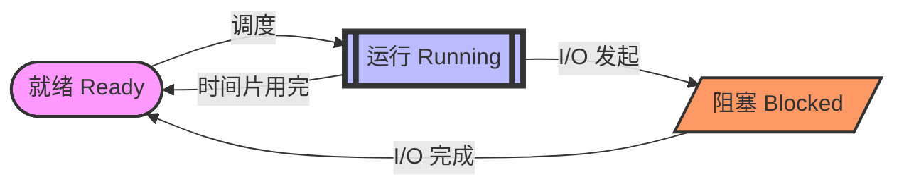
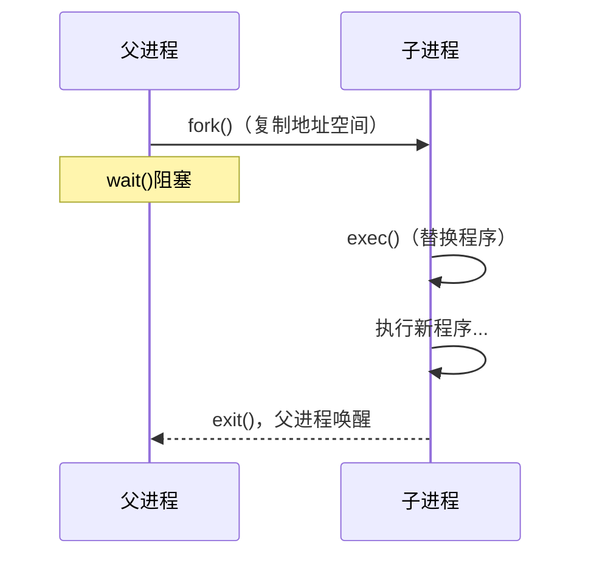

# 进程与API

> [!ABSTRACT] 核心矛盾：什么是进程？
> 程序是躺在硬盘里的代码（尸体），而**进程**是正在运行的程序（活的）。
> **OS 的目标**：通过虚拟化 CPU，让每个进程觉得自己在独占整个系统。

---

## 🧠第四章 抽象：进程

### 🤖1.进程的机器状态
- **访问的内存**（[[地址空间 (Address Space)|地址空间]]）：指令、数据、堆、栈
- **寄存器**：
  `PC`（程序计数器）：告诉我们程序即将执行哪个指令
  `SP`（栈指针）和 `FP`（帧指针）：管理函数参数栈、局部变量和返回地址
- **访问的持久存储设备（I/O 信息）**：可能包含当前打开的文件列表

### 🎨2.进程创建：更多细节
- 先将代码和所有静态数据加载到内存，放进进程的地址空间。
- 然后为运行时栈分配内存，也可能为堆分配内存。
- 还要完成输入输出（I/O）相关的初始化任务。
- 最后启动程序，也就是进入 `main()`。

### 💱3.进程状态
- **运行(running)**：进程在处理器上运行
- **就绪(ready)**：准备好运行，但因为 CPU 被别人占着，所以现在不运行
- **阻塞（blocked）**：发起 I/O 等操作后暂时不能继续，等事件完成后才回到就绪状态



### 4.进程控制块（PCB）

> [!INFO] 操作系统是通过 [[上下文切换 (Context Switch)]] 来实现 CPU 虚拟化的，而切换的数据支撑就是 **PCB**。

#### 大致概念:存储进程信息的个体结构

---

# 第五章 插叙：进程API

## 1.`fork()`
- `fork()` 系统调用会创建一个新的进程。新创建的进程叫**子进程**，原来的进程叫**父进程**。
- **`fork()` 的返回值**：父进程拿到子进程的 `PID`，子进程拿到 0。
- 子进程从 `fork()` 的返回处开始执行，而不是从 `main()` 入口重新开始。
   - 原因是 `fork()` 复制了父进程的完整地址空间，包括程序计数器 PC，子进程继承了父进程当前的执行位置。
- `fork()` 后父子进程的执行顺序不确定，由调度器决定 → 见 [[CPU 调度算法]]。

## 2.`wait()`
- 父进程调用 `wait()`，让自己先等着，直到子进程执行完毕。

## 3.`exec()`
- 这个系统调用可以让子进程执行与父进程不同的程序。
- `exec()` 会从可执行程序中加载代码和静态数据，并用它覆盖自己的代码段和静态数据，堆、栈及其他内存空间也会重新初始化。
- 失败会返回 -1。
- 常见变体有 `execl()`、`execle()`、`execlp()`、`execv()`、`execvp()`、`execvpe()`。

## 4.为什么要这么设计API
- 在大多数情况下，`shell` 会先在文件系统中找到可执行程序，然后用 `fork()` 创建子进程，用 `exec()` 的某个变体执行新程序，再用 `wait()` 等待命令完成。
- **`fork()`和`exec()`分离**，给子进程在执行新程序前留操作空间。Shell 的 `ls > out.txt` 本质上就是子进程在 exec 前偷偷换掉了标准输出符（standard output）的文件描述符。

## 5.例子以及图示
```c
int main() {
    int rc = fork();
    if (rc == 0) {
        // 子进程
        char *args[] = {"ls", NULL};
        execvp(args[0], args);
        // 到这里说明 exec 失败了
    } else {
        // 父进程
        wait(NULL);
        printf("child done\n");
    }
}
```


---
